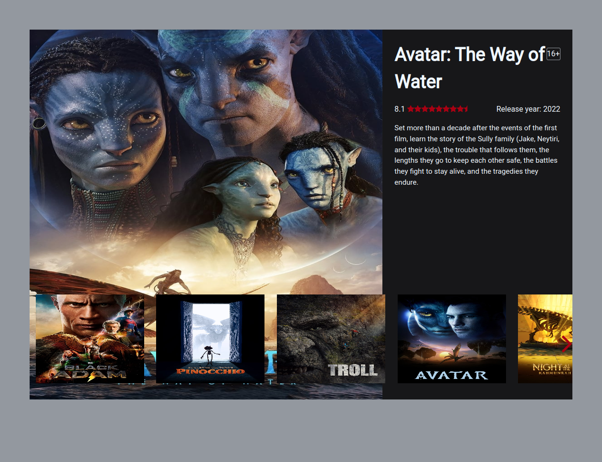
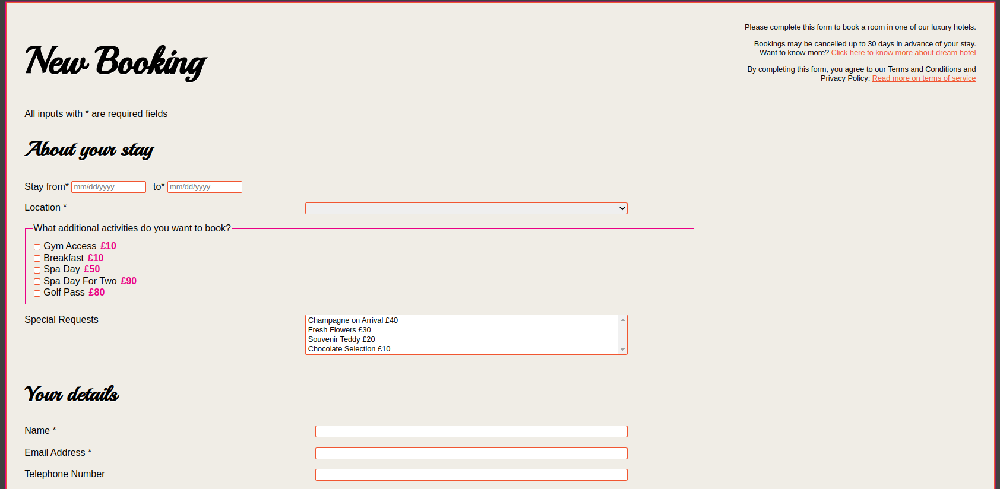
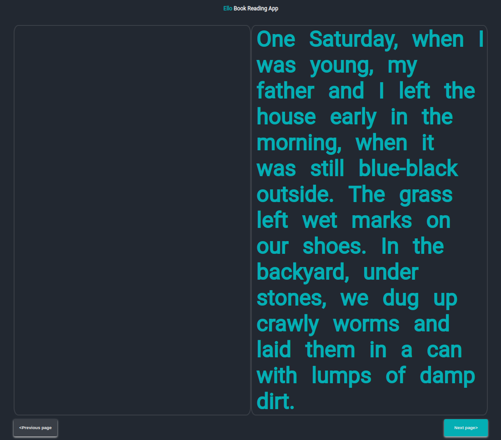
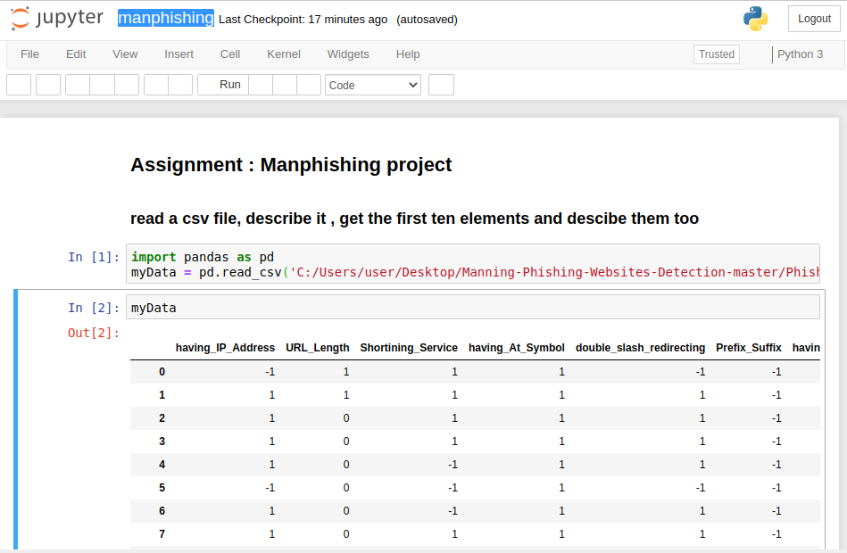
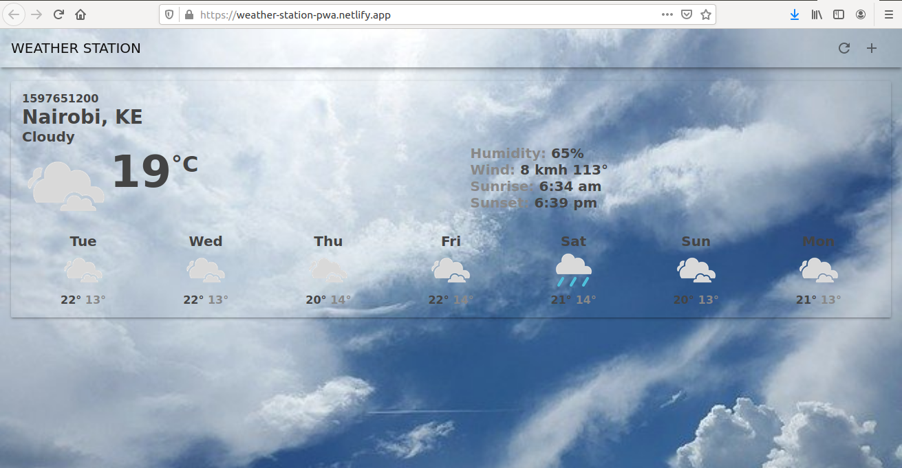
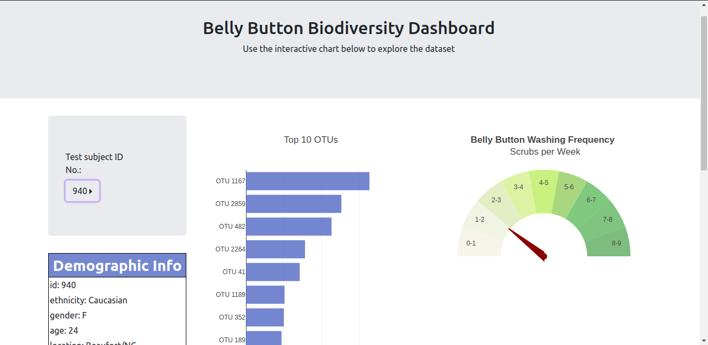
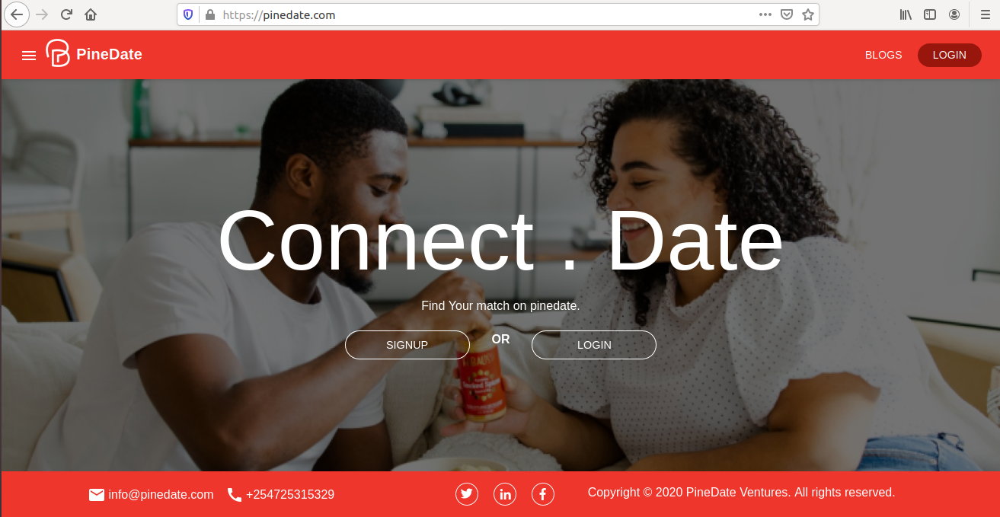

### Hi👋! 

[](https://jumakiwaka.github.io/)

I am Juma Kiwaka, a software developer. I currently focus on building for the web. I like to challenge myself to do more than what is expected of me or what I think I am capable of doing😄. I am constantly leveling up on technologies that I am currently using or those that I am interesting in using later on. On the side, I also love cycling:bike:, football:soccer: and reading books:book: about life, money, psychology and people!

<!--
**jumakiwaka/jumakiwaka** is a ✨ _special_ ✨ repository because its `README.md` (this file) appears on your GitHub profile.

Here are some ideas to get you started:

- 🔭 I’m currently working on ...
- 🌱 I’m currently learning ...
- 👯 I’m looking to collaborate on ...
- 🤔 I’m looking for help with ...
- 💬 Ask me about ...
- 📫 How to reach me: ...
- 😄 Pronouns: ...
- ⚡ Fun fact: ...
-->

#### Top Technologies

[](#) [](#) [](#) 
<!-- [](#) -->

### 📊 Monthly development breakdown

<!--START_SECTION:waka-->

```text

```

<!--END_SECTION:waka-->

### Experience

<p align="left">
  
  
  
  
  
  
  
  
  

  
  
  
  
  


</p>

<h2 id="sample-projects">Projects</h2>

<table>
   <tbody>
      <tr>
         <td>
            <a href="https://mini-netflix.netlify.app/">
            
            </a>
         </td>
         <td>
            <a href="https://mini-netflix.netlify.app/">Mini Netflix</a>
            <br />
            <br />
            <a href="https://github.com/jumakiwaka/mini-netflix-app">
            
            </a>
         </td>
         <td>
            <a href="https://jumakiwaka.github.io">
            
            </a>
         </td>
         <td>
            <a href="https://jumakiwaka.github.io">Smart Card</a>
            <br />
            <br />
            <a href="https://github.com/jumakiwaka/smartcard-app">
            
            </a>
         </td>
      </tr>
      <tr>
         <td>
            <a href="https://jumakiwaka.github.io">
            
            </a>
         </td>
         <td>
            <a href="https://jumakiwaka.github.io">My Accessible Form</a>
            <br />
            <br />
            <a href="https://github.com/jumakiwaka/my-accessible-form">
            
            </a>
         </td>
         <td>
            <a href="https://jumakiwaka.github.io">
            
            </a>
         </td>
         <td>
            <a href="https://jumakiwaka.github.io">EID 20</a>
            <br />
            <br />
            <a href="https://github.com/jumakiwaka/eid-20">
            
            </a>
         </td>
      </tr>
      <tr>
         <td>
            <a href="https://jumakiwaka.github.io">
            
            </a>
         </td>
         <td>
            <a href="https://jumakiwaka.github.io">Ello Book Reading</a>
            <br />
            <br />
            <a href="https://github.com/jumakiwaka/ello-book-reading-app">
            
            </a>
         </td>
         <td>
            <a href="https://jumakiwaka.github.io">
            
            </a>
         </td>
         <td>
            <a href="https://jumakiwaka.github.io">Manphishing</a>
            <br />
            <br />
            <a href="https://github.com/jumakiwaka/sc-projects">
            
            </a>
         </td>
      </tr>
      <tr>
         <td>
            <a href="https://weather-station-pwa.netlify.app/">
            
            </a>
         </td>
         <td>
            <a href="https://weather-station-pwa.netlify.app/">Weather Station PWA</a>
            <br />
            <br />
            <a href="https://github.com/jumakiwaka/">
            
            </a>
         </td>
         <td>
            <a href="https://jumakiwaka.github.io">
            
            </a>
         </td>
         <td>
            <a href="https://jumakiwaka.github.io">Belly Button Biodiversity Dashboard</a>
            <br />
            <br />
            <a href="https://github.com/jumakiwaka">
            
            </a>
         </td>
      </tr>
      <tr>
         <td>
            <a href="https://jumakiwaka.github.io">
            
            </a>
         </td>
         <td>
            <a href="https://jumakiwaka.github.io">PineDate</a>
            <br />
            <br />
            <a href="https://github.com/jumakiwaka/">
            
            </a>
         </td>
      </tr>
   </tbody>
</table>

<!--
<h2>Certifications</h2>  

<table>
  <tbody>
    <tr>
      <td>
        <a href="URL">
          
        </a>
      </td>
      <td>
        <a href="URL">Verify</a>
      </td>
      <td>
        <a href="URL">
          
        </a>
      </td>
      <td>
        <a href="URL">Verify</a>
      </td>
    </tr>
  </tbody>
</table>
-->

<h3 align="center" style="color:yellow;margin-bottom: 20px;" >Let's Connect </h3>  

<h3 align="center">
  <a href="https://www.linkedin.com/in/juma-kiwaka-7603b0181">
    
  </a>&nbsp;&nbsp;
 <a href="mailto:alijuma232@gmail.com">
    
 </a>&nbsp;&nbsp;
  <a href="https://twitter.com/jumakiwaka">
    
  </a>&nbsp;&nbsp;
  <a href="https://github.com/jumakiwaka">
            
  </a>&nbsp;&nbsp;
</h3>

## Contribution Graph

[](https://github.com/ashutosh00710/github-readme-activity-graph)

### 🏆 <!--My Trophies-->

[](https://github.com/jumakiwaka)

<!--### Github Stats-->

[](https://github.com/jumakiwaka)

<p></p>

<!--### Github extra pins-->

[](https://github.com/jumakiwaka/jumakiwaka&show_owner=true&count_private=true)

[](https://github.com/jumakiwaka/jumakiwaka)
<!-- 
[](https://wakatime.com/@jumakiwaka)

[](https://wakatime.com/@26cc90f6-22da-4220-ac7d-f452b6324239) -->

### Repo Views

[](https://github.com/jumakiwaka/kiwaka-views-counter)

<p>
  <a href="https://github.com/jumakiwaka?tab=followers">
    
  </a>
</p>

### 😂 Here is a random joke for you today: -


